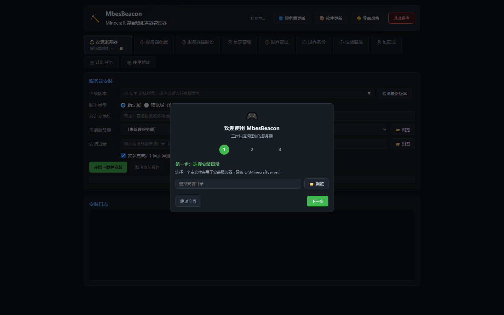

# MbesBeacon

**Languages: 中文 | [English](README_EN.md)**

<div align="center">

**Minecraft Bedrock Edition Server Beacon — Minecraft 基岩版服务器管理器**

[](https://github.com/dixinkala/MbesBeacon-Minecraft-Bedrock-Server/stargazers)
[](https://github.com/dixinkala/MbesBeacon-Minecraft-Bedrock-Server/network/members)
[](https://github.com/dixinkala/MbesBeacon-Minecraft-Bedrock-Server/releases)
[](https://github.com/dixinkala/MbesBeacon-Minecraft-Bedrock-Server/actions/workflows/ci.yml)
[](https://github.com/dixinkala/MbesBeacon-Minecraft-Bedrock-Server/actions/workflows/codeql.yml)
[](https://github.com/dixinkala/MbesBeacon-Minecraft-Bedrock-Server/actions/workflows/ci.yml)
[](https://github.com/dixinkala/MbesBeacon-Minecraft-Bedrock-Server/blob/main/LICENSE)
[](https://www.python.org/)
[](https://www.microsoft.com/windows)

**一键搭建 · 图形化管理 · 安全可靠 · 开箱即用**

</div>

---

MbesBeacon 是一款功能完整的 Minecraft 基岩版（Bedrock Edition）专用服务器管理工具，采用"系统托盘 + Web 管理界面"混合架构，让服务器的安装、配置、运维变得简单直观。

> ⭐ **如果这个项目对你有帮助，请给一个 Star！你的支持是我持续更新的动力！**

---

## 📸 界面预览

> 首次启动引导 · 三步快速搭建服务器

<p align="center">
  
</p>

> 操作演示（实机录制 · 循环播放）

<p align="center">
  
</p>

---

## ✨ 特性亮点

| 🚀 一键安装 | ⚙️ 图形化配置 | 🎮 玩家管理 | 💾 世界备份 |
|------------|-------------|------------|------------|
| 自动下载官方服务端，支持所有历史版本 | 30+ 配置项可视化编辑，配置历史回滚 | 在线玩家列表，权限/踢出/封禁/白名单 | 手动/自动备份，一键恢复，保留策略 |

| 📊 性能监控 | 📝 实时控制台 | 🕐 计划任务 | 🔒 安全可靠 |
|------------|-------------|------------|------------|
| 实时CPU/内存/玩家数监控 | SSE实时日志推送，命令自动补全 | 定时重启/备份/公告，自动化运维 | API Token认证，下载完整性校验，审计日志 |

---

## 📖 目录

- [快速开始](#快速开始)
- [项目解决什么问题](#项目解决什么问题)
- [主要功能](#主要功能)
- [系统要求](#系统要求)
- [安装方法](#安装方法)
- [使用方法](#使用方法)
- [输入输出示例](#输入输出示例)
- [项目结构](#项目结构)
- [安全特性](#安全特性)
- [贡献指南](#贡献指南)
- [常见问题](#常见问题)
- [许可证](#许可证)

---

## 🚀 快速开始

### 3步启动你的 Minecraft 基岩版服务器

```bash
# 1. 下载 MbesBeacon.exe
# 从 Releases 页面下载最新版本

# 2. 双击运行
# 程序自动打开浏览器管理界面 (http://127.0.0.1:19100)

# 3. 一键安装服务器
# 选择安装目录 → 选择版本 → 开始安装 → 自动启动
```

就是这么简单！无需命令行，无需手动配置，3分钟即可开服。

---

## 项目解决什么问题

Minecraft 基岩版专用服务器（BDS）的官方发布形式仅为一个 ZIP 压缩包，用户需要手动完成以下操作：

1. **下载困难**：需要从官网找到对应版本的下载链接，历史版本难以获取
2. **配置繁琐**：需要手动编辑 `server.properties` 文本文件，不熟悉的用户容易出错
3. **运维复杂**：需要通过命令行启动/停止服务器，手动输入指令管理玩家
4. **备份缺失**：没有内置的世界备份机制，误操作可能导致存档丢失
5. **监控缺失**：无法直观查看服务器运行状态、CPU/内存占用、在线玩家数

**MbesBeacon 将以上所有操作图形化、自动化**，用户只需通过浏览器访问本地管理界面，即可完成服务器的全生命周期管理。

---

## 主要功能

### 核心功能（10 大管理模块）

| 模块 | 功能说明 |
|------|----------|
| **① 安装服务器** | 一键下载安装官方服务端，支持所有历史稳定版和预览版；自定义下载地址；自动检测已安装服务器 |
| **② 服务器配置** | 图形化编辑 `server.properties`，支持 30+ 配置项；高级模式显示全部配置；配置历史回滚；数值范围校验 |
| **③ 服务器控制台** | SSE 实时日志推送（延迟<300ms）；启动/停止/重启；命令自动补全；命令历史记录；日志搜索/导出/清空 |
| **④ 玩家管理** | 在线玩家列表；权限设置（访客/成员/管理员）；踢出/封禁；白名单管理；黑名单管理；IP 封禁 |
| **⑤ 世界管理** | 多世界切换；世界重命名/复制/删除；存档导入/导出（ZIP 格式）；世界信息展示 |
| **⑥ 世界备份** | 手动备份；自动备份（删除/更新前触发）；备份列表管理；一键恢复；备份保留策略（默认10个） |
| **⑦ 性能监控** | 实时 CPU/内存占用；在线玩家数；运行状态；自动刷新（5秒）；操作审计日志 |
| **⑧ 包管理** | 资源包/行为包列表查看；启用/禁用包（编辑 `valid_known_packs.json`）；刷新包列表 |
| **⑨ 计划任务** | 定时重启服务器；定时备份世界；定时发送公告；任务启用/禁用/删除；补执行机制 |
| **⑩ 使用帮助** | 完整的内置使用文档，涵盖所有功能的详细说明 |

### 特色功能

- **系统托盘集成**：后台运行，托盘图标显示运行状态，右键菜单快速操作
- **多主题支持**：10 套预设主题（Minecraft 暗色、草方块绿、红石红、钻石蓝等）+ 自定义强调色
- **多服务器管理**：自动扫描已安装服务器，支持多服务器切换管理
- **服务器版本更新检测**：自动检测服务器新版本，一键更新（自动备份存档）
- **应用程序更新检测**：自动检测 MbesBeacon 软件新版本，支持手动检查更新，与服务器更新区分
- **下载完整性校验**：ZIP 完整性 + SHA256 哈希（首次信任机制）+ PE 签名校验 + 文件大小校验
- **断点续传下载**：支持 HTTP Range 请求，大文件中断后可续传
- **崩溃自动重启**：服务器意外崩溃时自动重启，指数退避 + 最大重试次数
- **端口占用检测**：启动前自动检测目标端口是否被占用

---

## 系统要求

| 项目 | 要求 |
|------|------|
| **操作系统** | Windows 10 / Windows 11（仅支持 Windows 平台） |
| **内存** | 建议 4GB 以上（服务器运行需要） |
| **磁盘空间** | 至少 300MB 可用空间（安装时自动检查，不足则中止）；建议 500MB 以上（含服务端下载和世界存档） |
| **网络** | 首次安装需要联网下载服务端；局域网联机需要同一 WiFi |
| **Python** | 仅开发环境需要 3.10+，发布版 EXE 无需安装 |

---

## 安装方法

### 方式一：直接运行 EXE（推荐普通用户）

1. 下载 `MbesBeacon.exe`
2. 双击运行，程序会自动：
   - 创建系统托盘图标
   - 在本地 `127.0.0.1:19100` 启动 HTTP 管理服务器
   - 自动打开浏览器管理界面
3. 首次启动会弹出交互式三步向导：
   - 第一步：选择安装目录
   - 第二步：选择服务器版本
   - 第三步：开始安装
4. 安装完成后自动启动服务器

> **注意**：首次运行可能弹出 Windows SmartScreen 警告，点击「更多信息」->「仍要运行」即可。本工具为开源本地工具，仅在本机运行，不会上传任何数据。

### 方式二：从源码运行（开发者）

```bash
# 克隆项目
git clone <repository-url>
cd MbesBeacon-Minecraft-Bedrock-Server

# 安装依赖
pip install -r requirements.txt

# 运行程序
python run.py
```

### 方式三：自行打包 EXE

```bash
# 安装 PyInstaller
pip install pyinstaller

# 打包（可选：设置证书密码进行数字签名）
# set CERT_PASS=你的密码
python -m PyInstaller --noconfirm --clean BedrockServerManager.spec

# 打包产物在 dist/MbesBeacon.exe
```

---

## 使用方法

### 快速开始

1. **启动程序**：双击 `MbesBeacon.exe`，浏览器自动打开管理界面（`http://127.0.0.1:19100`）
2. **安装服务器**：在「① 安装服务器」页面选择版本和安装目录，点击「开始下载并安装」
3. **配置服务器**：在「② 服务器配置」页面修改服务器名称、端口、最大玩家数等，点击「保存配置」
4. **启动服务器**：在「③ 服务器控制台」页面点击「启动服务器」，查看日志确认启动成功
5. **联机游玩**：在 Minecraft 中「服务器」->「添加服务器」，填写 `127.0.0.1:19132`（默认端口）

### 系统托盘操作

程序启动后最小化到系统托盘：

- **左键单击图标**：打开管理界面
- **右键单击图标**：显示菜单
  - 打开管理界面
  - 启动服务器 / 停止服务器（根据状态动态切换）
  - 退出程序

> **提示**：关闭浏览器页面不影响服务器运行，可通过托盘图标重新打开管理界面。

### 多服务器管理

- 程序启动时自动扫描桌面、文档、下载、C/D/E 盘等位置，查找所有已安装服务器
- **1 个服务器**：自动管理，不弹窗
- **多个服务器**：弹窗选择要管理的服务器
- **0 个服务器**：显示引导横幅，手动安装
- 可在「当前服务器」下拉框随时切换，或点击「浏览」手动选择目录

### 玩家管理

在「④ 玩家管理」页面：

- **在线玩家**：点击「刷新玩家列表」，对每个玩家可设置权限、踢出、加入黑名单
- **白名单**：输入玩家名直接加入，需在配置中开启 `allow-list` 才生效
- **黑名单**：显示已封禁玩家，可解封或手动添加
- **IP 封禁**：按 IP 地址封禁，应对恶意玩家换号骚扰

### 世界备份

在「⑥ 世界备份」页面：

- **立即备份**：手动备份当前 worlds 文件夹
- **恢复备份**：选择历史备份恢复，恢复前自动停止服务器并备份当前世界
- **自动备份**：删除/更新服务器前自动触发
- **备份位置**：服务器同级目录的 `_worlds_backups` 文件夹

---

## 输入输出示例

### 示例 1：安装服务器

**输入**：
- 安装目录：`D:\MinecraftServer`
- 版本：`1.21.0.03`（稳定版）
- 选项：安装完成后自动启动服务器

**输出**（安装日志）：
```
[10:30:15] 开始下载 Bedrock Server 1.21.0.03 ...
[10:30:15] 下载地址: https://www.minecraft.net/bedrockdedicatedserver/bin-win/bedrock-server-1.21.0.03.zip
[10:30:45] 下载完成，大小: 85.3 MB
[10:30:45] 正在校验文件完整性 ...
[10:30:46] ZIP 完整性校验通过
[10:30:46] SHA256 哈希: a1b2c3d4...（首次记录）
[10:30:46] PE 签名校验通过（文件格式与数字签名有效）
[10:30:46] 正在解压到 D:\MinecraftServer ...
[10:30:50] 解压完成
[10:30:50] 正在初始化配置 ...
[10:30:50] 安装完成！
[10:30:50] 正在启动服务器 ...
[10:30:52] 服务器启动成功，监听端口 19132
```

### 示例 2：服务器控制台输出

**输入**：在控制台输入 `list` 命令，按回车发送

**输出**（服务器日志）：
```
[10:35:20] [INFO] Starting Server
[10:35:21] [INFO] Loading properties
[10:35:21] [INFO] Default game type: SURVIVAL
[10:35:22] [INFO] Starting Minecraft server on 0.0.0.0:19132
[10:35:23] [INFO] IPv4 supported, port: 19132
[10:35:23] [INFO] IPv6 supported, port: 19133
[10:35:24] [INFO] Server started.
> list
[10:36:15] [INFO] There are 2/10 players online:
[10:36:15] [INFO] - Steve
[10:36:15] [INFO] - Alex
```

### 示例 3：玩家管理操作

**输入**：在「④ 玩家管理」页面，对在线玩家 "Steve" 点击「设置权限」-> 选择「管理员」

**输出**：
- 控制台日志：`[10:40:00] [INFO] Steve has been made an operator`
- 玩家卡片权限显示更新为：`管理员 (operator)`
- 操作审计日志记录：`[2026-09-03 10:40:00] PERMISSION_CHANGE player=Steve level=operator`

### 示例 4：世界备份

**输入**：在「⑥ 世界备份」页面点击「立即备份」

**输出**：
```
[10:45:00] 开始备份世界存档 ...
[10:45:00] 源目录: D:\MinecraftServer\worlds
[10:45:01] 目标目录: D:\_worlds_backups\backup_20260903_104500
[10:45:05] 备份完成，大小: 12.5 MB
[10:45:05] 当前备份数量: 3/10
```

备份列表显示：

| 备份名称 | 时间 | 大小 | 操作 |
|----------|------|------|------|
| backup_20260903_104500 | 2026-09-03 10:45 | 12.5 MB | 恢复 / 删除 |
| backup_20260902_203000 | 2026-09-02 20:30 | 12.3 MB | 恢复 / 删除 |

### 示例 5：API 接口调用（高级用户）

**请求**：获取服务器状态
```bash
curl -H "X-API-Token: <your-token>" http://127.0.0.1:19100/api/status
```

**响应**（JSON）：
```json
{
  "ok": true,
  "app": "mbesbeacon",
  "version": "1.0.23",
  "installed": true,
  "server_dir": "D:\\MinecraftServer",
  "installed_version": "1.21.0.03",
  "server_running": true,
  "latest_version": "1.21.1.01",
  "port": 19132,
  "lan_ip": "192.168.1.100"
}
```

---

## 项目结构

```
MbesBeacon-Minecraft-Bedrock-Server/
├── bedrock_server_manager/     # 主源码包
│   ├── __init__.py
│   ├── main.py                 # 程序入口，单实例检测，HTTP 服务器启动
│   ├── app_context.py          # AppContext 应用上下文（全局状态管理）
│   ├── di.py                   # 依赖注入容器
│   ├── app_update.py           # 应用程序更新检测
│   ├── constants.py            # 常量定义
│   ├── server.py               # ServerProcess，服务器进程管理
│   ├── console.py              # ConsoleBuffer，控制台日志缓冲
│   ├── install.py              # 下载、安装、版本检测
│   ├── config.py               # server.properties 读写，设置管理
│   ├── players.py              # 玩家管理、封禁、白名单
│   ├── worlds.py               # 世界管理、存档导入导出
│   ├── backup.py               # 备份/恢复/删除
│   ├── performance.py          # 性能监控（CPU/内存/玩家数）
│   ├── scheduler.py            # 计划任务调度
│   ├── security.py             # 安全校验、审计日志
│   ├── verify.py               # 下载完整性校验（ZIP/SHA256/PE签名）
│   ├── tray.py                 # 系统托盘图标
│   ├── ratelimit.py            # API 速率限制
│   ├── commands.py             # 命令自动补全
│   ├── state.py                # 全局状态管理（向后兼容）
│   ├── utils.py                # 通用工具函数
│   ├── app_logger.py           # 应用日志
│   ├── assets.py               # 资源管理
│   └── web/
│       ├── __init__.py
│       ├── handler.py          # HTTP 请求处理
│       ├── app.py              # AppContext 应用上下文（Web 层）
│       ├── route_decorator.py  # 路由装饰器
│       ├── index.html          # 前端单页面（HTML/CSS/JS）
│       └── routes/             # 路由模块
│           ├── __init__.py
│           ├── get_routes.py   # GET 路由
│           ├── post_extra.py   # POST 路由（扩展）
│           ├── misc.py         # 杂项路由（退出、主题等）
│           ├── console.py      # 控制台路由
│           ├── server.py       # 服务器路由
│           ├── worlds.py       # 世界管理路由
│           ├── backups.py      # 备份管理路由
│           ├── commands.py     # 命令路由
│           ├── players.py      # 玩家管理路由
│           └── config.py       # 配置管理路由
├── tests/                      # 测试套件（18个测试文件，433个测试用例）
│   ├── __init__.py
│   ├── test_unit.py            # 单元测试（配置/玩家/备份/安装/工具函数）
│   ├── test_integration.py     # 集成测试（模块间协作、状态同步）
│   ├── test_e2e.py             # 端到端测试（完整流程模拟）
│   ├── test_routes.py          # 路由测试（路由注册、认证、404、危险端点）
│   ├── test_scheduler_tray.py  # 计划任务/托盘测试
│   ├── test_crash_restart.py   # 崩溃重启测试（指数退避、最大重试）
│   ├── test_app_context.py     # AppContext 测试（单例、状态管理）
│   ├── test_app_logger.py      # 应用日志测试
│   ├── test_console.py         # 控制台测试（日志缓冲、SSE流）
│   ├── test_di.py              # 依赖注入容器测试
│   ├── test_p3_regression.py   # P3 门禁回归测试
│   ├── test_performance.py     # 性能监控测试
│   ├── test_ratelimit.py       # 速率限制测试（令牌桶算法）
│   ├── test_review_fixes.py    # 全面复查修复回归测试
│   ├── test_security.py        # 安全测试（命令校验、API Token生成）
│   ├── test_verify.py          # 验证测试（SHA256计算、文件大小、ZIP完整性）
│   ├── test_worlds_export.py   # 世界存档导出测试
│   └── test_modules.py         # 模块测试（世界管理、命令模块、应用日志）
├── dist/                       # 构建产物（MbesBeacon.exe）
├── .github/                    # GitHub Actions CI 工作流
├── BedrockServerManager.spec   # PyInstaller 打包配置
├── build.bat                   # 构建启动器（调用 build.ps1）
├── build.ps1                   # PowerShell 构建脚本（含自动签名）
├── create_cert.ps1             # 自签名证书生成脚本（PowerShell）
├── sign_exe.ps1                # EXE 数字签名工具（PowerShell）
├── version_info.txt            # 版本信息文件
├── run.py                      # 开发环境运行入口
├── smoke_test.py               # 冒烟测试脚本
├── requirements.txt            # Python 运行时依赖
├── requirements-dev.txt        # Python 开发/测试依赖
├── pyproject.toml              # 项目配置（pytest/ruff）
├── .pre-commit-config.yaml     # pre-commit 配置
├── .gitignore                  # Git 忽略文件
├── LICENSE                     # MIT 许可证
├── CODE_OF_CONDUCT.md          # 行为准则
├── CONTRIBUTING.md             # 贡献指南
├── SECURITY.md                 # 安全政策
└── README.md                   # 本文档
```

---

## 安全特性

MbesBeacon 内置多项安全机制，确保服务器和本地数据安全：

| 安全机制 | 实现方式 |
|----------|----------|
| **API 认证** | 随机 32 位 Token + Origin/Referer 校验，防止 CSRF 攻击 |
| **下载完整性校验** | ZIP 完整性 + SHA256 哈希（首次信任机制 TOFU）+ PE 签名校验 + 文件大小范围 |
| **PE 签名验证** | 使用 WinVerifyTrust API 验证 bedrock_server.exe 的数字签名是否存在且有效（不校验签名者身份） |
| **危险操作二次确认** | 删除服务器、恢复备份等操作需确认，防止误操作 |
| **操作审计日志** | 记录所有危险操作（启动/停止/删除、配置修改、玩家管理、备份恢复） |
| **API 速率限制** | 令牌桶算法，防止前端 bug 或恶意脚本频繁操作 |
| **ZIP 路径遍历防护** | 解压前检查目标路径边界，防止 Zip Slip 攻击 |
| **输入校验** | 玩家名正则校验、IP 地址格式校验、配置项数值范围校验 |
| **单实例检测** | 命名互斥量防止多开冲突 |
| **本地监听** | HTTP 服务器仅绑定 `127.0.0.1`，不对外暴露 |

---

## 常见问题

### Q：首次运行弹出"Windows 已保护你的电脑"怎么办？
A：这是 Windows SmartScreen 警告。点击「更多信息」->「仍要运行」即可启动。

### Q：关闭管理页面后服务器还在运行吗？
A：在。关闭浏览器页面不影响服务器，再次双击 exe 或通过系统托盘可重新打开管理界面。

### Q：如何彻底退出（含服务器）？
A：先在控制台「停止服务器」，再点标题栏「退出程序」，或右键托盘图标选择「退出程序」。

### Q：别人进不来服务器？
A：检查以下几点：
1. 防火墙是否放行 UDP 19132
2. 是否同一局域网 / 端口映射是否正确
3. 服务器是否已启动
4. 在线模式是否需要关闭（离线账号需要）

### Q：下载服务端失败 / 报 SSL 错误？
A：
1. 勾选"网络异常时跳过 SSL 校验"后重试
2. 使用"自定义下载地址"粘贴第三方链接
3. 检查网络是否能访问 minecraft.net

### Q：版本列表加载不出来 / 显示版本很少？
A：版本列表从 Bedrock-OSS 社区 GitHub 仓库获取，网络不通时回退到内置常用版本。可检查网络是否能访问 GitHub，或直接手动输入版本号。

### Q：修改配置后不生效？
A：配置需重启服务器后生效。在控制台点「停止」再「启动」即可。

### Q：世界存档在哪？怎么备份？
A：在服务器目录的 worlds 文件夹。删除/更新服务器前程序会自动备份到 `_worlds_backups` 文件夹（保留最近 10 个），也可在「⑥ 世界备份」页手动备份。

### Q：端口被占用怎么办？
A：在「② 服务器配置」修改 server-port 为其他端口（如 19133），保存后重启。启动前程序会自动检测端口占用情况。

### Q：如何更新服务器到最新版本？
A：选择服务器后自动检测更新，或点标题栏「服务器更新」手动检测。发现新版本后点「立即更新」，程序自动停服、清理旧程序（保留世界存档和配置）、下载安装新版本。

### Q：如何更新 MbesBeacon 软件到最新版本？
A：点标题栏「软件更新」手动检测 MbesBeacon 软件新版本。注意：软件更新与服务器更新是两个独立的功能，软件更新不会影响已安装的服务器。

### Q：系统托盘图标不显示怎么办？
A：检查 Windows 托盘隐藏区域（任务栏右下角箭头），可将 MbesBeacon 图标拖到任务栏固定显示。

---

## 🤝 贡献指南

我们欢迎任何形式的贡献！无论是提交 Bug 报告、功能建议，还是直接提交代码，都非常感谢。

### 如何贡献

1. **Fork 本仓库**
2. **创建功能分支**：`git checkout -b feature/AmazingFeature`
3. **提交更改**：`git commit -m 'Add some AmazingFeature'`
4. **推送到分支**：`git push origin feature/AmazingFeature`
5. **开启 Pull Request**

### 开发环境搭建

```bash
# 克隆项目
git clone https://github.com/dixinkala/MbesBeacon-Minecraft-Bedrock-Server.git
cd MbesBeacon-Minecraft-Bedrock-Server

# 安装依赖
pip install -r requirements.txt

# 运行开发版本
python run.py

# 运行测试
pytest tests/ -v

# 代码格式化
ruff format .

# 代码检查
ruff check .
```

### 代码规范

- 遵循 [PEP 8](https://peps.python.org/pep-0008/) 代码风格
- 使用 `ruff` 进行代码格式化和检查
- 所有新功能必须包含单元测试
- 提交信息遵循 [Conventional Commits](https://www.conventionalcommits.org/) 规范

### 报告 Bug

提交 Bug 时请包含：
- 操作系统版本（Windows 10/11）
- MbesBeacon 版本号
- 复现步骤
- 预期行为 vs 实际行为
- 截图/日志（如有）

详细指南请查看 [CONTRIBUTING.md](CONTRIBUTING.md)。

---

## ⭐ 支持项目

如果你觉得这个项目对你有帮助，可以通过以下方式支持：

- ⭐ **给项目点个 Star**
- 🔀 **Fork 项目并参与贡献**
- 🐛 **提交 Bug 报告和功能建议**
- 💬 **在社区中分享这个项目**
- ☕ **请开发者喝杯咖啡**（可选）

你的每一个 Star 都是我持续更新的动力！

---

## 许可证

本项目采用 [MIT 许可证](LICENSE) 开源。

---

## 致谢

- [Bedrock-OSS/BDS-Versions](https://github.com/Bedrock-OSS/BDS-Versions)：提供 Bedrock 服务端版本列表
- [Minecraft](https://www.minecraft.net/)：基岩版专用服务器（BDS）官方发布
- 所有贡献者和用户的反馈与支持
