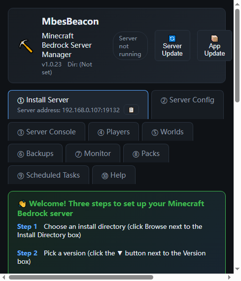
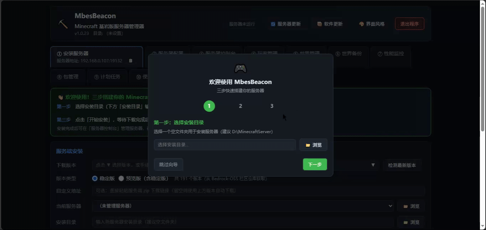

# MbesBeacon

<div align="center">

**Minecraft Bedrock Edition Server Beacon — Minecraft Bedrock Server Manager**

[](https://github.com/dixinkala/MbesBeacon-Minecraft-Bedrock-Server/stargazers)
[](https://github.com/dixinkala/MbesBeacon-Minecraft-Bedrock-Server/network/members)
[](https://github.com/dixinkala/MbesBeacon-Minecraft-Bedrock-Server/releases)
[](https://github.com/dixinkala/MbesBeacon-Minecraft-Bedrock-Server/actions/workflows/ci.yml)
[](https://github.com/dixinkala/MbesBeacon-Minecraft-Bedrock-Server/actions/workflows/codeql.yml)
[](https://github.com/dixinkala/MbesBeacon-Minecraft-Bedrock-Server/actions/workflows/ci.yml)
[](https://github.com/dixinkala/MbesBeacon-Minecraft-Bedrock-Server/blob/main/LICENSE)
[](https://www.python.org/)
[](https://www.microsoft.com/windows)

**One-click Setup · GUI Management · Secure & Reliable · Out-of-the-box**

</div>

**Languages: [中文](README.md) | English**

---

MbesBeacon is a full-featured management tool for Minecraft Bedrock Edition dedicated servers (BDS), built on a "system tray + web management UI" hybrid architecture. It makes installing, configuring, and operating a Bedrock server simple and intuitive.

> ⭐ **If this project helps you, please give it a Star! Your support keeps me updating!**

---

## 📸 UI Preview

> First-run wizard · Set up your server in three steps

<p align="center">
  
</p>

> Live demo (recorded from the real app · looping)

<p align="center">
  
</p>

---

## ✨ Highlights

| 🚀 One-click Install | ⚙️ GUI Configuration | 🎮 Player Management | 💾 World Backup |
|------------|-------------|------------|------------|
| Automatic download of the official server, all historical versions supported | 30+ config items with visual editing, config history rollback | Online player list, permission/kick/ban/allow-list | Manual/automatic backup, one-click restore, retention policy |

| 📊 Performance Monitor | 📝 Live Console | 🕐 Scheduled Tasks | 🔒 Secure & Reliable |
|------------|-------------|------------|------------|
| Real-time CPU/memory/player count monitoring | SSE real-time log push, command auto-completion | Scheduled restart/backup/announcement, automated ops | API Token auth, download integrity verification, audit log |

---

## 📖 Table of Contents

- [Quick Start](#quick-start)
- [What Problem Does This Solve](#what-problem-does-this-solve)
- [Main Features](#main-features)
- [System Requirements](#system-requirements)
- [Installation](#installation)
- [Usage](#usage)
- [Input / Output Examples](#input--output-examples)
- [Project Structure](#project-structure)
- [Security Features](#security-features)
- [Contributing](#contributing)
- [FAQ](#faq)
- [License](#license)

---

## 🚀 Quick Start

### Start your Minecraft Bedrock server in 3 steps

```bash
# 1. Download MbesBeacon.exe
# Get the latest version from the Releases page

# 2. Double-click to run
# The program automatically opens the browser management UI (http://127.0.0.1:19100)

# 3. Install the server with one click
# Choose an install directory → choose a version → start install → auto start
```

That's it! No command line, no manual configuration — your server is up in 3 minutes.

---

## What Problem Does This Solve

The official Minecraft Bedrock dedicated server (BDS) is distributed only as a ZIP archive, forcing users to do everything manually:

1. **Hard to download**: You have to find the download link for a specific version on the official site; historical versions are hard to get
2. **Tedious configuration**: You must edit the `server.properties` text file by hand, and unfamiliar users make mistakes easily
3. **Complex operations**: Starting/stopping the server and managing players require command-line commands
4. **No backup**: There is no built-in world backup mechanism; mistakes can lose your world saves
5. **No monitoring**: No way to see server status, CPU/memory usage, or online player count at a glance

**MbesBeacon turns all of the above into a graphical, automated experience.** You only need a browser to access the local management UI to manage the server across its entire lifecycle.

---

## Main Features

### Core Features (10 management modules)

| Module | Description |
|------|----------|
| **① Install Server** | One-click download and install of the official server; all historical stable and preview versions supported; custom download URL; auto-detects installed servers |
| **② Server Config** | Graphical editing of `server.properties`, 30+ config items supported; advanced mode shows all options; config history rollback; numeric range validation |
| **③ Server Console** | SSE real-time log push (latency <300ms); start/stop/restart; command auto-completion; command history; log search/export/clear |
| **④ Player Management** | Online player list; permissions (visitor/member/operator); kick/ban; allow-list management; blacklist management; IP ban |
| **⑤ World Management** | Multi-world switching; world rename/copy/delete; world import/export (ZIP); world info display |
| **⑥ World Backup** | Manual backup; automatic backup (before delete/update); backup list management; one-click restore; retention policy (10 by default) |
| **⑦ Performance Monitor** | Real-time CPU/memory usage; online player count; running status; auto-refresh (5s); operation audit log |
| **⑧ Pack Management** | Resource pack/behavior pack list; enable/disable packs (edit `valid_known_packs.json`); refresh pack list |
| **⑨ Scheduled Tasks** | Scheduled server restart; scheduled world backup; scheduled announcements; task enable/disable/delete; catch-up execution |
| **⑩ Usage Help** | Complete built-in documentation covering every feature in detail |

### Special Features

- **System tray integration**: Runs in the background, tray icon shows running status, right-click menu for quick actions
- **Multiple themes**: 10 preset themes (Minecraft dark, grass green, redstone red, diamond blue, etc.) + custom accent colors
- **Multi-server management**: Automatically scans for installed servers, switch between multiple servers
- **Server version update detection**: Auto-detects new server versions, one-click update (with automatic world backup)
- **App update detection**: Auto-detects new MbesBeacon releases, manual check supported, distinct from server updates
- **Download integrity verification**: ZIP integrity + SHA256 hash (trust-on-first-use) + PE signature check + file size check
- **Resumable downloads**: HTTP Range support, resume after interruption
- **Crash auto-restart**: Automatically restarts the server after an unexpected crash, exponential backoff + max retry count
- **Port conflict detection**: Automatically checks whether the target port is in use before starting

---

## System Requirements

| Item | Requirement |
|------|------|
| **OS** | Windows 10 / Windows 11 (Windows only) |
| **Memory** | 4GB or more recommended (the server needs it) |
| **Disk space** | At least 300MB free (auto-checked during install; aborts if insufficient); 500MB+ recommended (server download + world saves) |
| **Network** | Internet needed for the first install; same Wi-Fi for LAN play |
| **Python** | 3.10+ only needed for development; the released EXE needs no Python |

---

## Installation

### Method 1: Run the EXE directly (recommended for most users)

1. Download `MbesBeacon.exe`
2. Double-click to run. The program will automatically:
   - Create a system tray icon
   - Start the HTTP management server on local `127.0.0.1:19100`
   - Open the browser management UI
3. On first launch an interactive 3-step wizard appears:
   - Step 1: Choose an install directory
   - Step 2: Choose a server version
   - Step 3: Start the install
4. The server starts automatically after installation

> **Note**: On first run Windows SmartScreen may warn "Windows protected your PC". Click "More info" → "Run anyway". This is an open-source local tool that runs only on your machine and uploads nothing.

### Method 2: Run from source (developers)

```bash
# Clone the repository
git clone <repository-url>
cd MbesBeacon-Minecraft-Bedrock-Server

# Install dependencies
pip install -r requirements.txt

# Run the program
python run.py
```

### Method 3: Build the EXE yourself

```bash
# Install PyInstaller
pip install pyinstaller

# Build (optionally set a certificate password for signing)
# set CERT_PASS=your_password
python -m PyInstaller --noconfirm --clean BedrockServerManager.spec

# The build output is at dist/MbesBeacon.exe
```

---

## Usage

### Quick Start

1. **Launch**: Double-click `MbesBeacon.exe`; the browser opens the management UI automatically (`http://127.0.0.1:19100`)
2. **Install a server**: On the "① Install Server" page, choose a version and install directory, click "Download & Install"
3. **Configure**: On the "② Server Config" page, edit server name, port, max players, etc., click "Save Config"
4. **Start**: On the "③ Server Console" page, click "Start Server" and check the log to confirm startup
5. **Play**: In Minecraft, "Play" → "Servers" → "Add Server", enter `127.0.0.1:19132` (default port)

### System Tray

After launch, the program minimizes to the system tray:

- **Left-click the icon**: Open the management UI
- **Right-click the icon**: Show the menu
  - Open management UI
  - Start server / Stop server (switches dynamically by state)
  - Exit program

> **Tip**: Closing the browser page does not stop the server; reopen the UI from the tray icon anytime.

### Multi-server Management

- On startup the program automatically scans locations such as Desktop, Documents, Downloads, and C/D/E drives for installed servers
- **1 server**: manages it automatically, no dialog
- **Multiple servers**: a dialog asks which server to manage
- **0 servers**: shows a guide banner, install manually
- Switch anytime from the "Current Server" dropdown, or click "Browse" to pick a directory manually

### Player Management

On the "④ Player Management" page:

- **Online players**: Click "Refresh Player List"; for each player you can set permissions, kick, or blacklist
- **Allow-list**: Type a player name to add; only effective when `allow-list` is enabled in config
- **Blacklist**: Shows banned players; you can pardon or add manually
- **IP ban**: Ban by IP address to handle players who harass by switching accounts

### World Backup

On the "⑥ World Backup" page:

- **Back up now**: Manually back up the current worlds folder
- **Restore**: Pick a historical backup to restore; the server stops and the current world is backed up first
- **Automatic backup**: Triggered automatically before deleting/updating the server
- **Backup location**: The `_worlds_backups` folder next to the server directory

---

## Input / Output Examples

### Example 1: Installing a server

**Input**:
- Install directory: `D:\MinecraftServer`
- Version: `1.21.0.03` (stable)
- Option: auto-start the server after install

**Output** (install log):
```
[10:30:15] Start downloading Bedrock Server 1.21.0.03 ...
[10:30:15] Download URL: https://www.minecraft.net/bedrockdedicatedserver/bin-win/bedrock-server-1.21.0.03.zip
[10:30:45] Download complete, size: 85.3 MB
[10:30:45] Verifying file integrity ...
[10:30:46] ZIP integrity check passed
[10:30:46] SHA256 hash: a1b2c3d4... (first-recorded)
[10:30:46] PE signature check passed (file format and digital signature valid)
[10:30:46] Extracting to D:\MinecraftServer ...
[10:30:50] Extraction complete
[10:30:50] Initializing config ...
[10:30:50] Installation complete!
[10:30:50] Starting server ...
[10:30:52] Server started, listening on port 19132
```

### Example 2: Server console output

**Input**: Type the `list` command in the console and press Enter

**Output** (server log):
```
[10:35:20] [INFO] Starting Server
[10:35:21] [INFO] Loading properties
[10:35:21] [INFO] Default game type: SURVIVAL
[10:35:22] [INFO] Starting Minecraft server on 0.0.0.0:19132
[10:35:23] [INFO] IPv4 supported, port: 19132
[10:35:23] [INFO] IPv6 supported, port: 19133
[10:35:24] [INFO] Server started.
> list
[10:36:15] [INFO] There are 2/10 players online:
[10:36:15] [INFO] - Steve
[10:36:15] [INFO] - Alex
```

### Example 3: Player management

**Input**: On the "④ Player Management" page, click "Set Permission" on online player "Steve" → choose "Operator"

**Output**:
- Console log: `[10:40:00] [INFO] Steve has been made an operator`
- Player card permission display updates to: `Operator (operator)`
- Audit log entry: `[2026-09-03 10:40:00] PERMISSION_CHANGE player=Steve level=operator`

### Example 4: World backup

**Input**: Click "Back Up Now" on the "⑥ World Backup" page

**Output**:
```
[10:45:00] Start backing up world saves ...
[10:45:00] Source directory: D:\MinecraftServer\worlds
[10:45:01] Target directory: D:\_worlds_backups\backup_20260903_104500
[10:45:05] Backup complete, size: 12.5 MB
[10:45:05] Current backup count: 3/10
```

The backup list shows:

| Backup name | Time | Size | Actions |
|----------|------|------|----------|
| backup_20260903_104500 | 2026-09-03 10:45 | 12.5 MB | Restore / Delete |
| backup_20260902_203000 | 2026-09-02 20:30 | 12.3 MB | Restore / Delete |

### Example 5: API calls (advanced users)

**Request**: Get server status
```bash
curl -H "X-API-Token: <your-token>" http://127.0.0.1:19100/api/status
```

**Response** (JSON):
```json
{
  "ok": true,
  "app": "mbesbeacon",
  "version": "1.0.23",
  "installed": true,
  "server_dir": "D:\\MinecraftServer",
  "installed_version": "1.21.0.03",
  "server_running": true,
  "latest_version": "1.21.1.01",
  "port": 19132,
  "lan_ip": "192.168.1.100"
}
```

---

## Project Structure

```
MbesBeacon-Minecraft-Bedrock-Server/
├── bedrock_server_manager/     # Main source package
│   ├── __init__.py
│   ├── main.py                 # Program entry, single-instance check, HTTP server startup
│   ├── app_context.py          # AppContext application context (global state management)
│   ├── di.py                   # Dependency injection container
│   ├── app_update.py           # App update detection
│   ├── constants.py            # Constants
│   ├── server.py               # ServerProcess, server process management
│   ├── console.py              # ConsoleBuffer, console log buffer
│   ├── install.py              # Download, install, version detection
│   ├── config.py               # server.properties read/write, settings management
│   ├── players.py              # Player management, ban, allow-list
│   ├── worlds.py               # World management, save import/export
│   ├── backup.py               # Backup/restore/delete
│   ├── performance.py          # Performance monitoring (CPU/memory/players)
│   ├── scheduler.py            # Scheduled task scheduling
│   ├── security.py             # Security validation, audit log
│   ├── verify.py               # Download integrity verification (ZIP/SHA256/PE signature)
│   ├── tray.py                 # System tray icon
│   ├── ratelimit.py            # API rate limiting
│   ├── commands.py             # Command auto-completion
│   ├── state.py                # Global state management (backward compatible)
│   ├── utils.py                # Utility functions
│   ├── app_logger.py           # Application logging
│   ├── assets.py               # Asset management
│   └── web/
│       ├── __init__.py
│       ├── handler.py          # HTTP request handling
│       ├── app.py              # AppContext application context (web layer)
│       ├── route_decorator.py  # Route decorator
│       ├── index.html          # Front-end single page (HTML/CSS/JS)
│       └── routes/             # Route modules
│           ├── __init__.py
│           ├── get_routes.py   # GET routes
│           ├── post_extra.py   # POST routes (extended)
│           ├── misc.py         # Misc routes (exit, theme, etc.)
│           ├── console.py      # Console routes
│           ├── server.py       # Server routes
│           ├── worlds.py       # World management routes
│           ├── backups.py      # Backup management routes
│           ├── commands.py     # Command routes
│           ├── players.py      # Player management routes
│           └── config.py       # Config management routes
├── tests/                      # Test suite (18 test files, 433 test cases)
│   ├── __init__.py
│   ├── test_unit.py            # Unit tests (config/players/backup/install/utils)
│   ├── test_integration.py     # Integration tests (module cooperation, state sync)
│   ├── test_e2e.py             # End-to-end tests (full flow simulation)
│   ├── test_routes.py          # Route tests (registration, auth, 404, dangerous endpoints)
│   ├── test_scheduler_tray.py  # Scheduled task / tray tests
│   ├── test_crash_restart.py   # Crash restart tests (exponential backoff, max retries)
│   ├── test_app_context.py     # AppContext tests (singleton, state management)
│   ├── test_app_logger.py      # App log tests
│   ├── test_console.py         # Console tests (log buffer, SSE stream)
│   ├── test_di.py              # DI container tests
│   ├── test_p3_regression.py   # P3 gate regression tests
│   ├── test_performance.py     # Performance monitoring tests
│   ├── test_ratelimit.py       # Rate limit tests (token bucket)
│   ├── test_review_fixes.py    # Full review fix regression tests
│   ├── test_security.py        # Security tests (command validation, API token generation)
│   ├── test_verify.py          # Verification tests (SHA256, file size, ZIP integrity)
│   ├── test_worlds_export.py   # World save export tests
│   └── test_modules.py         # Module tests (world management, commands, app log)
├── dist/                       # Build output (MbesBeacon.exe)
├── .github/                    # GitHub Actions CI workflows
├── BedrockServerManager.spec   # PyInstaller build config
├── build.bat                   # Build launcher (calls build.ps1)
├── build.ps1                   # PowerShell build script (with auto-signing)
├── create_cert.ps1             # Self-signed certificate generation script (PowerShell)
├── sign_exe.ps1                # EXE digital signing tool (PowerShell)
├── version_info.txt            # Version info file
├── run.py                      # Development entry point
├── smoke_test.py               # Smoke test script
├── requirements.txt            # Python runtime dependencies
├── requirements-dev.txt        # Python dev/test dependencies
├── pyproject.toml              # Project config (pytest/ruff)
├── .pre-commit-config.yaml     # pre-commit config
├── .gitignore                  # Git ignore rules
├── LICENSE                     # MIT License
├── CODE_OF_CONDUCT.md          # Code of conduct
├── CONTRIBUTING.md             # Contributing guide
├── SECURITY.md                 # Security policy
└── README.md                   # This document
```

---

## Security Features

MbesBeacon ships with multiple security mechanisms to keep your server and local data safe:

| Mechanism | Implementation |
|----------|----------|
| **API auth** | Random 32-char Token + Origin/Referer validation to prevent CSRF |
| **Download integrity** | ZIP integrity + SHA256 hash (TOFU) + PE signature check + file size range |
| **PE signature check** | Uses WinVerifyTrust to verify the bedrock_server.exe digital signature exists and is valid (does not validate the signer identity) |
| **Confirm for dangerous actions** | Deleting a server, restoring a backup, etc. require confirmation to prevent accidents |
| **Operation audit log** | Records all dangerous operations (start/stop/delete, config changes, player management, backup restore) |
| **API rate limiting** | Token bucket algorithm, prevents front-end bugs or malicious scripts from hammering the API |
| **ZIP path traversal protection** | Checks target path boundaries before extraction to prevent Zip Slip |
| **Input validation** | Player name regex, IP address format, config numeric range validation |
| **Single-instance check** | Named mutex to prevent multiple instances |
| **Local only** | HTTP server binds only to `127.0.0.1`, never exposed externally |

---

## FAQ

### Q: On first run, Windows shows "Windows protected your PC". What do I do?
A: This is the Windows SmartScreen warning. Click "More info" → "Run anyway" to launch.

### Q: Is the server still running after I close the management page?
A: Yes. Closing the browser page does not stop the server. Double-click the exe again or use the tray icon to reopen the management UI.

### Q: How do I fully exit (including the server)?
A: Stop the server in the console first, then click "Exit Program" in the title bar, or right-click the tray icon and choose "Exit Program".

### Q: Friends can't join my server?
A: Check the following:
1. Is the firewall allowing UDP 19132?
2. Are you on the same LAN / is port forwarding correct?
3. Is the server started?
4. Does online mode need to be disabled (required for offline accounts)?

### Q: Server download fails / SSL error?
A:
1. Enable "Skip SSL verification when network is abnormal" and retry
2. Paste a third-party link as a "custom download URL"
3. Check whether the network can reach minecraft.net

### Q: The version list won't load / shows very few versions?
A: The version list comes from the Bedrock-OSS community GitHub repository; it falls back to built-in common versions when the network fails. Check GitHub connectivity, or enter a version number manually.

### Q: Config changes have no effect?
A: Config takes effect after a server restart. Click "Stop" then "Start" in the console.

### Q: Where are the world saves? How do I back them up?
A: They are in the worlds folder of the server directory. Before deleting/updating the server, the program automatically backs them up to `_worlds_backups` (keeping the latest 10); you can also back up manually on the "⑥ World Backup" page.

### Q: Port already in use?
A: Change server-port on the "② Server Config" page (e.g., to 19133), save, and restart. The program checks for port conflicts before starting.

### Q: How do I update the server to the latest version?
A: Select the server and updates are detected automatically, or click "Server Update" in the title bar to check manually. When a new version is found, click "Update Now"; the program stops the server, cleans the old program (keeping world saves and config), downloads, and installs the new version.

### Q: How do I update MbesBeacon to the latest version?
A: Click "Software Update" in the title bar to check for new MbesBeacon releases manually. Note: software updates and server updates are two independent features; a software update never affects installed servers.

### Q: The system tray icon is missing?
A: Check the Windows tray overflow area (arrow at the bottom-right of the taskbar); you can drag the MbesBeacon icon onto the taskbar to pin it.

---

## 🤝 Contributing

We welcome contributions of any kind! Bug reports, feature suggestions, and code submissions are all appreciated.

### How to contribute

1. **Fork this repository**
2. **Create a feature branch**: `git checkout -b feature/AmazingFeature`
3. **Commit your changes**: `git commit -m 'Add some AmazingFeature'`
4. **Push to the branch**: `git push origin feature/AmazingFeature`
5. **Open a Pull Request**

### Setting up the dev environment

```bash
# Clone the project
git clone https://github.com/dixinkala/MbesBeacon-Minecraft-Bedrock-Server.git
cd MbesBeacon-Minecraft-Bedrock-Server

# Install dependencies
pip install -r requirements.txt

# Run the dev version
python run.py

# Run tests
pytest tests/ -v

# Format code
ruff format .

# Lint
ruff check .
```

### Code standards

- Follow [PEP 8](https://peps.python.org/pep-0008/) style
- Use `ruff` for formatting and linting
- All new features must include unit tests
- Commit messages follow [Conventional Commits](https://www.conventionalcommits.org/)

### Reporting bugs

When filing a bug report, please include:
- OS version (Windows 10/11)
- MbesBeacon version
- Reproduction steps
- Expected vs. actual behavior
- Screenshots/logs (if any)

See [CONTRIBUTING.md](CONTRIBUTING.md) for the full guide.

---

## ⭐ Support the Project

If you find this project helpful, you can support it in these ways:

- ⭐ **Star the repo**
- 🔀 **Fork and contribute**
- 🐛 **File bug reports and feature requests**
- 💬 **Share the project in your community**
- ☕ **Buy the developer a coffee** (optional)

Every Star keeps me updating!

---

## License

This project is open-sourced under the [MIT License](LICENSE).

---

## Acknowledgements

- [Bedrock-OSS/BDS-Versions](https://github.com/Bedrock-OSS/BDS-Versions): Bedrock server version list
- [Minecraft](https://www.minecraft.net/): Official Minecraft Bedrock dedicated server (BDS)
- All contributors and users for their feedback and support
